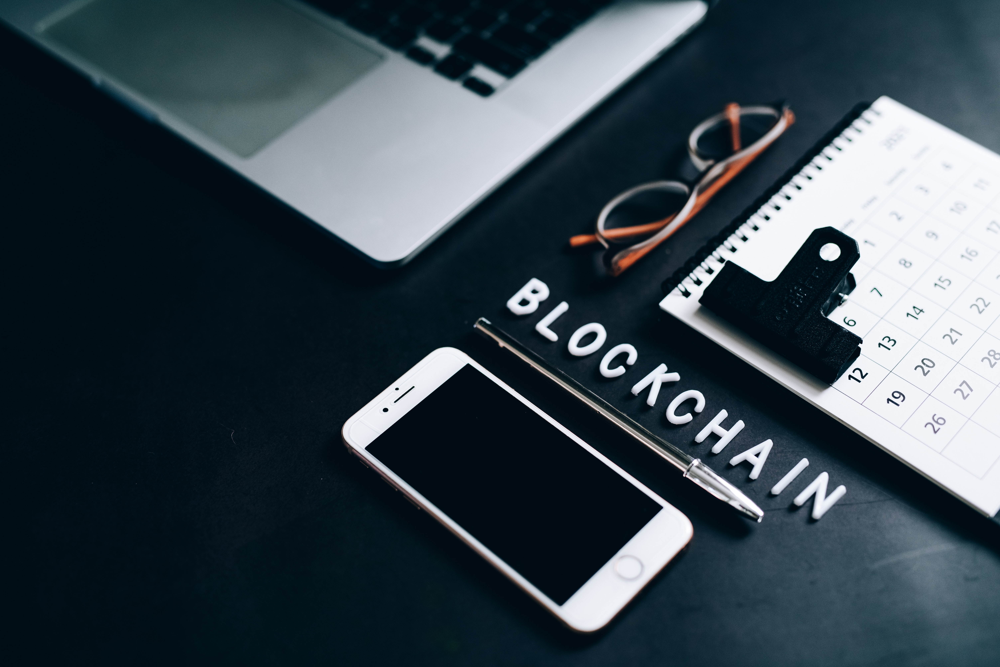

Introduction:

Blockchain technology has been making waves in various industries, and education is no exception. As the world becomes more interconnected and data-driven, the need for secure, transparent, and efficient systems in education is more crucial than ever. In this blog post, we will explore how blockchain can revolutionize the education sector by enhancing security, improving record-keeping, and fostering innovative learning experiences.

### Secure and Immutable Record-Keeping
One of the most promising applications of blockchain in education is the creation of secure and tamper-proof digital records for students and institutions. Blockchain's decentralized and immutable nature ensures that academic credentials, transcripts, and certificates cannot be altered or forged once they are stored on the network. This not only increases trust in the authenticity of these documents but also simplifies the process of verification for employers and other institutions.

### Streamlining Administration and Reducing Costs
Blockchain can help educational institutions streamline various administrative tasks, such as enrollment, attendance, and assessment tracking. By automating these processes, institutions can reduce the time and resources spent on paperwork, allowing them to focus on more important tasks, such as improving the quality of education. Moreover, blockchain-based systems can reduce the costs associated with data storage and management by eliminating the need for centralized databases and intermediaries.

### Enhancing Data Privacy and Security 
Data breaches and privacy concerns are significant issues in today's digital age. Blockchain technology can provide a more secure platform for storing and sharing sensitive student data, as it relies on advanced cryptographic techniques and a decentralized architecture. This ensures that student data remains confidential and protected from unauthorized access, while still being easily accessible to authorized parties when needed.

### Facilitating Global Collaboration and Credential Recognition
Blockchain can help bridge the gap between different educational systems and enable seamless collaboration and credential recognition across borders. With a universal and decentralized platform for storing and verifying academic records, students and professionals can more easily pursue educational and career opportunities in different countries without the hassle of navigating through various accreditation systems.

### Encouraging Personalized and Lifelong Learning 
Blockchain can empower students to take control of their learning experiences by enabling them to create a comprehensive and verifiable portfolio of their achievements, skills, and competencies. This decentralized learning record can be updated continuously throughout their lives, allowing them to showcase their growth and adapt to the ever-changing job market. Additionally, blockchain's smart contract capabilities can be used to develop personalized learning paths and reward systems, further enhancing the learning experience.

### Conclusion

Blockchain technology has the potential to transform the education sector by introducing greater security, efficiency, and transparency. As educational institutions continue to explore and adopt this technology, we can expect to see a more interconnected, innovative, and learner-centric educational landscape in the future. While challenges and limitations still exist, the potential benefits of leveraging blockchain in education are worth exploring and investing in.
