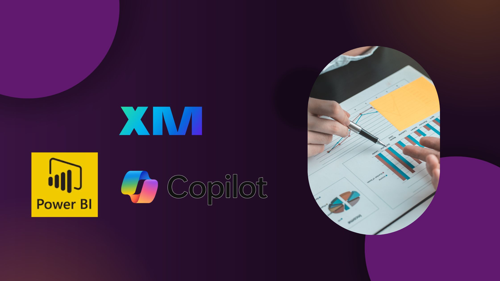

# Harnessing the Power of Qualtrics, Power BI, and Copilot: Revolutionizing Survey Analysis

In today’s data-driven world, gathering insights from surveys is only half the battle—the real challenge lies in analyzing the data and identifying the gaps that can drive meaningful change. Over the past year, I embarked on a journey to integrate three powerful tools—**Qualtrics**, **Power BI**, and **Copilot**—to streamline our survey processes and generate actionable insights that bridge critical gaps in our understanding.

## Qualtrics: The Foundation of Data Collection

Qualtrics has long been my go-to platform for creating and administering surveys. Its robust features allow me to design custom surveys tailored to the unique needs of each project. For my latest survey initiative, I leveraged Qualtrics to craft a comprehensive questionnaire that captured faculty perspectives on technology, teaching, and research support. With advanced skip logic, real-time response tracking, and customizable branding, Qualtrics provided a seamless experience for both survey creators and respondents.

## Power BI: Transforming Data into Visual Insights

Once the data was collected, the next step was to make sense of it all. That’s where Power BI came into play. I exported the survey results from Qualtrics and imported them into Power BI, where I created dynamic dashboards that revealed key trends and gaps. Power BI’s intuitive interface and powerful data visualization capabilities allowed me to build interactive charts, graphs, and heat maps that made complex data sets easy to understand at a glance.

One of the most exciting aspects of using Power BI was its ability to cross-filter data. By setting up interactive visuals, I could drill down into specific areas—whether it was overall satisfaction, modality preferences, or technology support—and pinpoint where improvements were needed. This approach not only helped identify current strengths but also highlighted areas with significant gaps in support or training.

## Copilot: Automating Insights and Narrative Generation

Integrating Copilot into the workflow added a whole new dimension to the analysis process. Copilot’s AI-driven capabilities allowed me to quickly generate natural language summaries and narratives based on the data visualizations in Power BI. Instead of manually writing extensive reports, I could simply ask Copilot to “explain the key trends and gaps” from the latest dashboard. The result was a set of insightful, concise summaries that captured the essence of the survey findings—an invaluable asset for sharing with stakeholders who may not have the time to delve into raw data.

## Bringing New Ideas to the Table

By combining Qualtrics for robust data collection, Power BI for deep and interactive analysis, and Copilot for automated insights, I’ve been able to bridge the gap between data and decision-making. This integrated approach not only improves the efficiency of survey analysis but also brings new ideas to the table by uncovering subtle trends and providing a narrative that drives strategic action.

For anyone looking to enhance their survey process, I highly recommend exploring this trio of tools. Together, they create a powerful ecosystem that transforms raw survey data into a compelling story of insights and opportunities—helping organizations make informed, data-backed decisions.

Feel free to leave your thoughts or questions in the comments below, and join me in this exciting journey of data-driven innovation!

